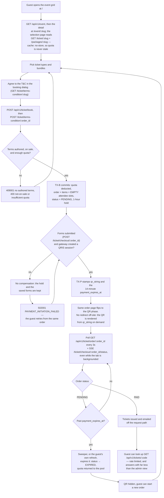
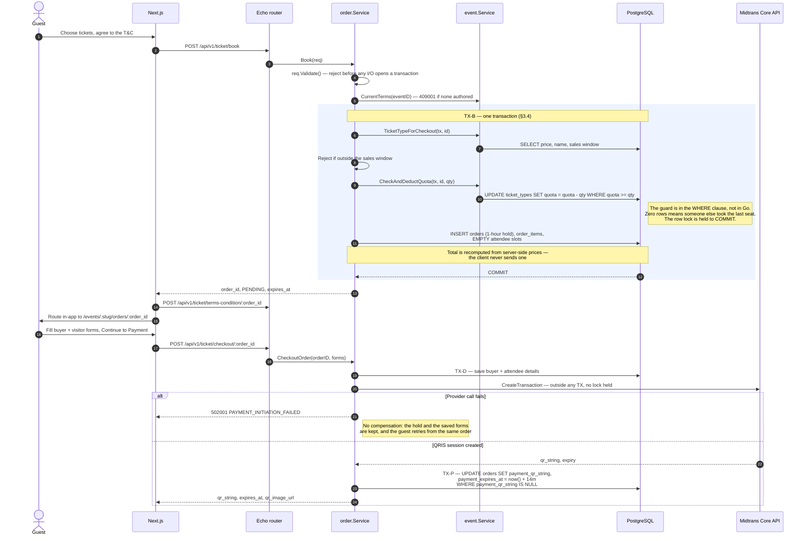
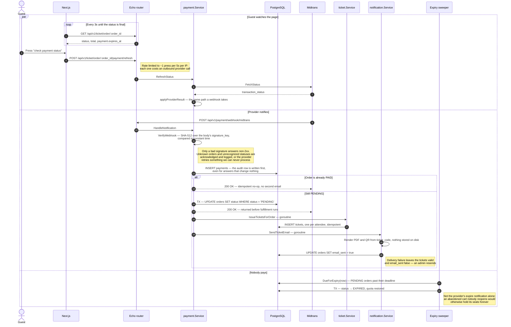
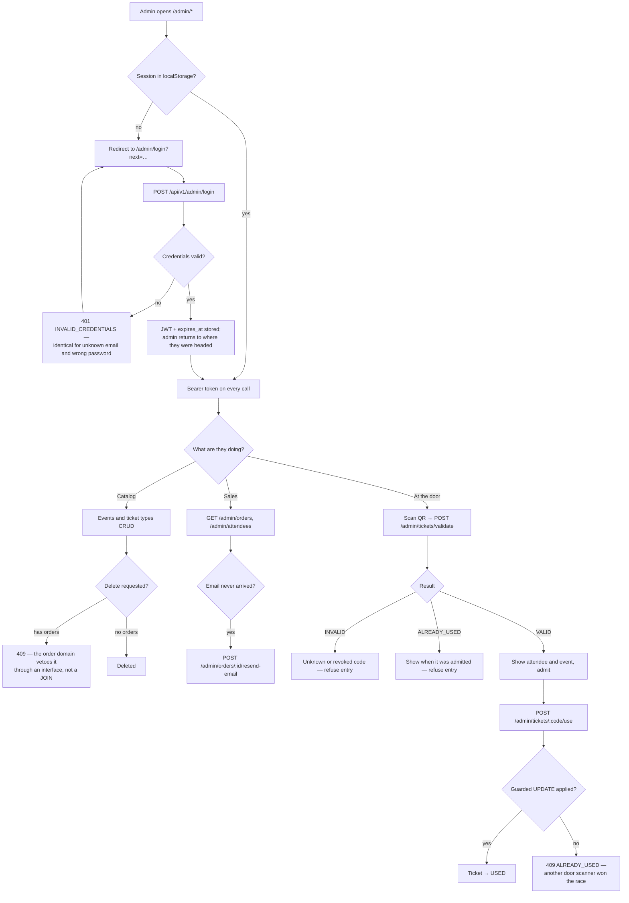
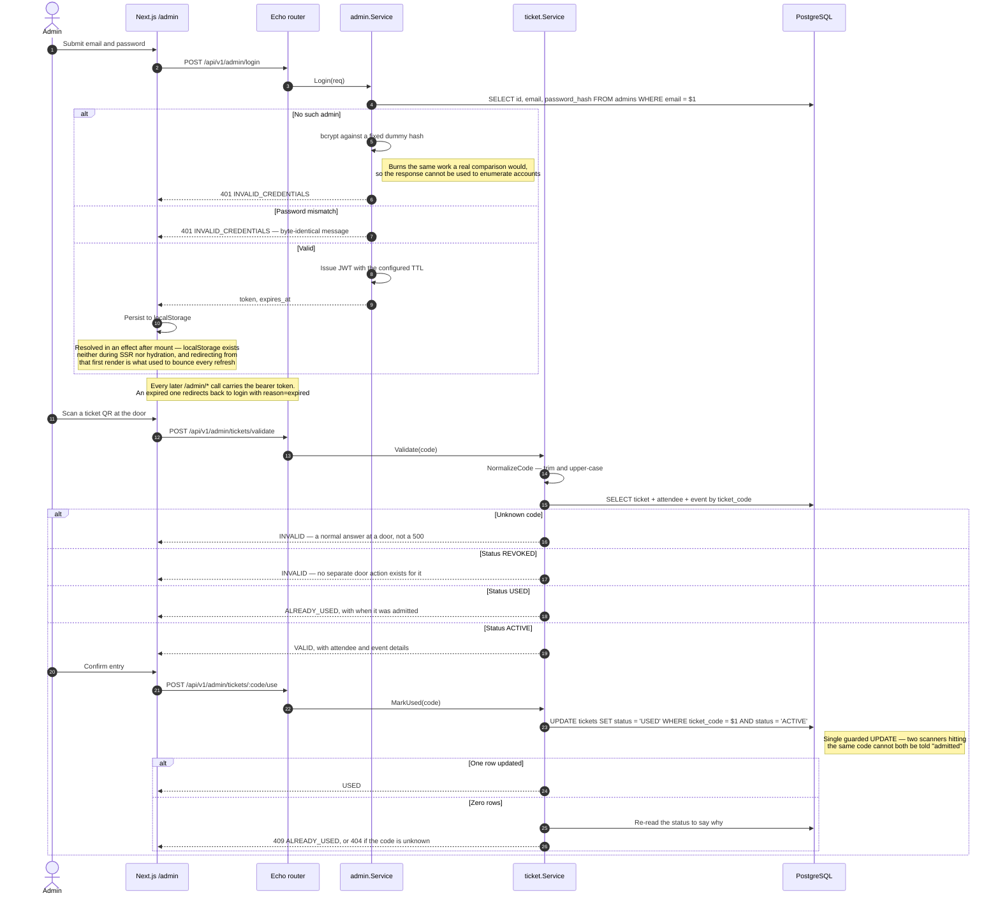

# The AI MUST enforce the Modular Monolith pattern strictly.

**3.1. Directory Structure Rule**

All business logic MUST strictly follow this domain-driven directory structure. Do not use MVC layer-first grouping.
Plaintext

```
backend/
├── cmd/
│   └── api/
│       └── main.go                 # App entry point, Router setup, DI setup
├── internal/
│   ├── admin/                      # Domain: JWT Auth, Admin Management
│   ├── event/                      # Domain: Events & Ticket Types
│   ├── order/                      # Domain: Checkout, Order Items, Attendees
│   ├── payment/                    # Domain: Gateway interfaces, Webhooks
│   ├── ticket/                     # Domain: QR Code, Validation, Ticket Gen
│   └── notification/               # Domain: SMTP Email, PDF Maroto Gen
├── pkg/                            # Shared utilities (DB connection, config, logger)
└── migrations/                     # golang-migrate up/down pairs (also the sqlc source)
```

**3.2. Cross-Domain Communication (Strict Rule)**

Rule: Domains MUST NOT import repositories from other domains.

Rule: Domains MUST NOT execute SQL JOINs across tables belonging to different domains for Write/Update operations.

Solution: Use Interfaces. For example, if the order domain needs to check event quota, it must do so by calling an interface injected into OrderService.


```
Go

// Example inside internal/order/service.go
type EventProvider interface {
    CheckAndDeductQuota(ctx context.Context, tx pgx.Tx, ticketTypeID uuid.UUID, qty int) error
}
```

**3.3. DTO Isolation**

Rule: sqlc generated database structs MUST NOT be leaked to the HTTP response. Every domain must have a dto.go defining the exact JSON shape.

**3.4. Critical Data Flows & Mitigations**

DB Transactions (Booking, spec 008): POST /api/v1/ticket/book MUST wrap the creation of orders, order_items, empty attendee slots, and atomic deduction of quota in a single SQL Transaction (BEGIN ... COMMIT). Pass pgx.Tx via context or explicitly to queries. POST /api/v1/ticket/checkout/:order_id saves the visitor forms in its own transaction and calls the payment gateway only after it commits.

Quota Restoration (Abandoned Cart): The webhook handler MUST listen for expire, cancel, or deny statuses. Upon receipt, update order status to Expired/Cancelled and atomically restore the quota in the ticket_types table.

Next.js Caching: Frontend fetch requests for Event Lists and Quotas MUST disable Next.js aggressive caching (e.g., cache: 'no-store').

Webhook Idempotency: Webhook handlers MUST check order status. If status == "PAID", immediately return 200 OK.

Async Processing & Visibility: Post-payment processing (PDF generation, QR creation, SMTP dispatch) MUST run in a non-blocking Go Goroutine. Update the email_sent = true flag upon successful email delivery. The webhook must return 200 OK instantly to the payment provider.

**3.5. Payment Gateway Abstraction**

The internal/payment domain must define an interface to allow swapping gateways without touching the order domain:

```
Go

type Gateway interface {
    CreateTransaction(order *dto.OrderInfo) (url string, err error)
    VerifyWebhook(payload []byte, signature string) (*dto.WebhookResult, error)
}
```

**3.6. Schema Migrations**

Rule: the schema is owned by `golang-migrate`, not by the application. The API
binary MUST NOT migrate on startup, and the runtime image does not ship the
migration files.

Every version is a pair — `{version}_{name}.up.sql` and `{version}_{name}.down.sql`
— and the `down` must genuinely reverse the `up`. Applied versions are recorded in
`schema_migrations`, which is what makes a migration run exactly once and lets a
database report the version it is on.

`docker compose up` runs a one-shot `migrate` service that the API `depends_on`
with `service_completed_successfully`, so the binary never serves against a schema
it was not generated for. `sqlc.yaml` points `schema:` at the directory: sqlc
replays the `up` files in order and ignores the `down` ones.

**3.7. Guest Flow**

The guest never authenticates. Everything below is reachable with an order number
or a ticket code alone, which is why the public reads are deliberately narrower
than the admin ones and the ticket lookup is rate limited per IP.

*Journey and decision points*



*Checkout — the reservation sequence*

The gateway round-trip sits deliberately **outside** TX1: the quota-deducting
`UPDATE` holds its row lock until commit, so a 200–500 ms provider call inside the
transaction would serialize every concurrent buyer of the same ticket type.



*Settlement — three paths racing for the same order*

A webhook, the guest's refresh button, and the expiry sweeper can all reach the
same order at once. They converge on one guarded transition — `UPDATE orders SET
status … WHERE status = 'PENDING'` — which is what makes quota restoration and
ticket generation happen exactly once no matter who wins.



**3.8. Admin Flow**

Every `/admin/*` route except login sits behind the JWT middleware. The frontend's
route guard is a convenience redirect only — the API rejects an unauthenticated
request whatever the browser chose to render.

*Journey and decision points*



*Login and door validation*



***