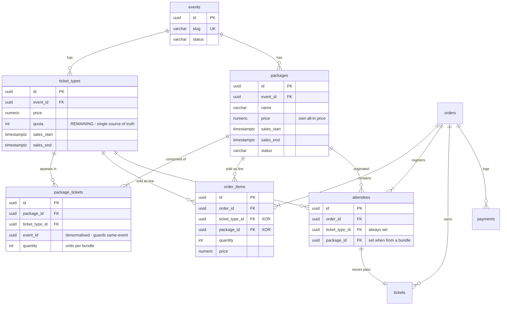

# Contract: Schema — Ticket Package Bundles

Companion to `../spec.md`. Additive against the current `SCHEMA.md`; nothing is renamed and
no existing column is dropped.

## 1. Naming reconciliation

The request specifies a `tickets` table carrying `quota`. This codebase already ships that
table under the name **`ticket_types`**, and already uses the name `tickets` for *issued
passes* generated after payment. Since the instruction is to keep the current schema, the
mapping is:

| Request term | Actual table | Role |
| --- | --- | --- |
| `events` | `events` | unchanged |
| `tickets` (quota-bearing) | `ticket_types` | sole inventory record |
| `packages` | `packages` | **new** — no quota column |
| `package_tickets` | `package_tickets` | **new** — junction, FK → `ticket_types` |
| — | `tickets` | pre-existing: issued pass, one per attendee |

The junction keeps the requested name `package_tickets`; its FK column is `ticket_type_id`
because that is the table it points at.

## 2. ERD



Reading of the hierarchy: **Event → Ticket → Package**. A package hangs off an event and
reaches back *down* into that event's tickets through the junction. It never owns stock; it
is a view over stock.

## 3. New tables

```sql
-- Required so package_tickets can enforce same-event composition via composite FKs.
-- Both are no-ops for uniqueness (id is already PK) and exist purely as FK targets.
ALTER TABLE ticket_types
    ADD CONSTRAINT ticket_types_id_event_uk UNIQUE (id, event_id);

ALTER TABLE packages
    ADD CONSTRAINT packages_id_event_uk UNIQUE (id, event_id);
```

### 3.1 `packages`

```sql
-- 9. PACKAGES (Bundle offers)
-- DELIBERATELY has no quota / inventory / stock column. Availability is derived at read
-- time from the remaining quota of the ticket_types reached through package_tickets.
-- Adding an inventory column here would create a second source of truth and reintroduce
-- the overselling this design exists to prevent.
CREATE TABLE packages (
    id UUID PRIMARY KEY DEFAULT uuid_generate_v4(),
    event_id UUID NOT NULL REFERENCES events(id) ON DELETE RESTRICT,
    name VARCHAR(255) NOT NULL,
    description TEXT,
    price NUMERIC(12, 2) NOT NULL CHECK (price >= 0),
    sales_start TIMESTAMP WITH TIME ZONE NOT NULL,
    sales_end TIMESTAMP WITH TIME ZONE NOT NULL,
    status VARCHAR(50) NOT NULL DEFAULT 'ACTIVE'
        CHECK (status IN ('ACTIVE', 'INACTIVE')),
    created_at TIMESTAMP WITH TIME ZONE DEFAULT CURRENT_TIMESTAMP,
    updated_at TIMESTAMP WITH TIME ZONE DEFAULT CURRENT_TIMESTAMP,
    CONSTRAINT packages_sales_window_chk CHECK (sales_end > sales_start),
    CONSTRAINT packages_id_event_uk UNIQUE (id, event_id)
);
```

`price` is the all-in bundle price and is intentionally not validated against the sum of its
constituents — pricing above or below that sum is the administrator's call (spec Edge Cases).

### 3.2 `package_tickets`

```sql
-- 10. PACKAGE_TICKETS (composition junction)
-- event_id is denormalised solely so the two composite foreign keys below can make
-- cross-event composition structurally impossible rather than merely discouraged. A
-- package on event A can never reference a ticket_type on event B: both composite FKs
-- resolve against the same event_id value in this row.
CREATE TABLE package_tickets (
    id UUID PRIMARY KEY DEFAULT uuid_generate_v4(),
    package_id UUID NOT NULL,
    ticket_type_id UUID NOT NULL,
    event_id UUID NOT NULL,
    quantity INT NOT NULL DEFAULT 1 CHECK (quantity > 0),
    created_at TIMESTAMP WITH TIME ZONE DEFAULT CURRENT_TIMESTAMP,

    CONSTRAINT package_tickets_package_fk
        FOREIGN KEY (package_id, event_id)
        REFERENCES packages (id, event_id) ON DELETE CASCADE,

    -- RESTRICT: a ticket_type that is part of any bundle cannot be deleted until it is
    -- removed from that bundle (FR-038).
    CONSTRAINT package_tickets_ticket_type_fk
        FOREIGN KEY (ticket_type_id, event_id)
        REFERENCES ticket_types (id, event_id) ON DELETE RESTRICT,

    -- A ticket appears at most once per package; repeats are expressed via quantity.
    CONSTRAINT package_tickets_unique_member UNIQUE (package_id, ticket_type_id)
);
```

"At least one constituent" (FR-016) is **not** expressible as a table constraint without a
deferred trigger; it is enforced in the service layer on create and on composition update,
and re-asserted by the availability query returning no rows (treated as unavailable).

### 3.3 Changes to existing tables

```sql
-- order_items becomes a XOR line: either an individual ticket_type line or a package line.
-- A package line is stored ONCE at the package's own price, so total_amount stays the exact
-- sum of quantity * price and no synthetic per-constituent price allocation is needed.
ALTER TABLE order_items
    ADD COLUMN package_id UUID REFERENCES packages(id) ON DELETE RESTRICT;

ALTER TABLE order_items
    ALTER COLUMN ticket_type_id DROP NOT NULL;

ALTER TABLE order_items
    ADD CONSTRAINT order_items_line_kind_chk CHECK (
        (ticket_type_id IS NOT NULL AND package_id IS NULL) OR
        (ticket_type_id IS NULL     AND package_id IS NOT NULL)
    );

ALTER TABLE order_items
    ADD CONSTRAINT order_items_quantity_chk CHECK (quantity > 0);

-- attendees keeps ticket_type_id NOT NULL: every registrant is still bound to exactly one
-- ticket_type, which is what preserves the constitution's one-pass-per-attendee rule for
-- bundles. package_id only records which bundle the slot came from, for grouping in the
-- PDF/email and in admin views.
ALTER TABLE attendees
    ADD COLUMN package_id UUID REFERENCES packages(id) ON DELETE RESTRICT;
```

### 3.4 Indexes

```sql
CREATE INDEX idx_packages_event_id          ON packages(event_id);
CREATE INDEX idx_package_tickets_package_id ON package_tickets(package_id);
-- Drives both the "which bundles does this ticket feed" lookup and the delete guard.
CREATE INDEX idx_package_tickets_ticket_type_id ON package_tickets(ticket_type_id);
-- Partial: only package lines, which are the minority, and the only rows the
-- package delete-guard scans.
CREATE INDEX idx_order_items_package_id    ON order_items(package_id) WHERE package_id IS NOT NULL;
CREATE INDEX idx_attendees_order_id        ON attendees(order_id);
```

## 4. Migration

`backend/migrations/000003_packages.up.sql`

```sql
BEGIN;

ALTER TABLE ticket_types ADD CONSTRAINT ticket_types_id_event_uk UNIQUE (id, event_id);

CREATE TABLE packages (
    id UUID PRIMARY KEY DEFAULT uuid_generate_v4(),
    event_id UUID NOT NULL REFERENCES events(id) ON DELETE RESTRICT,
    name VARCHAR(255) NOT NULL,
    description TEXT,
    price NUMERIC(12, 2) NOT NULL CHECK (price >= 0),
    sales_start TIMESTAMP WITH TIME ZONE NOT NULL,
    sales_end TIMESTAMP WITH TIME ZONE NOT NULL,
    status VARCHAR(50) NOT NULL DEFAULT 'ACTIVE' CHECK (status IN ('ACTIVE', 'INACTIVE')),
    created_at TIMESTAMP WITH TIME ZONE DEFAULT CURRENT_TIMESTAMP,
    updated_at TIMESTAMP WITH TIME ZONE DEFAULT CURRENT_TIMESTAMP,
    CONSTRAINT packages_sales_window_chk CHECK (sales_end > sales_start),
    CONSTRAINT packages_id_event_uk UNIQUE (id, event_id)
);

CREATE TABLE package_tickets (
    id UUID PRIMARY KEY DEFAULT uuid_generate_v4(),
    package_id UUID NOT NULL,
    ticket_type_id UUID NOT NULL,
    event_id UUID NOT NULL,
    quantity INT NOT NULL DEFAULT 1 CHECK (quantity > 0),
    created_at TIMESTAMP WITH TIME ZONE DEFAULT CURRENT_TIMESTAMP,
    CONSTRAINT package_tickets_package_fk FOREIGN KEY (package_id, event_id)
        REFERENCES packages (id, event_id) ON DELETE CASCADE,
    CONSTRAINT package_tickets_ticket_type_fk FOREIGN KEY (ticket_type_id, event_id)
        REFERENCES ticket_types (id, event_id) ON DELETE RESTRICT,
    CONSTRAINT package_tickets_unique_member UNIQUE (package_id, ticket_type_id)
);

ALTER TABLE order_items ADD COLUMN package_id UUID REFERENCES packages(id) ON DELETE RESTRICT;
ALTER TABLE order_items ALTER COLUMN ticket_type_id DROP NOT NULL;
ALTER TABLE order_items ADD CONSTRAINT order_items_line_kind_chk CHECK (
    (ticket_type_id IS NOT NULL AND package_id IS NULL) OR
    (ticket_type_id IS NULL     AND package_id IS NOT NULL)
);
ALTER TABLE order_items ADD CONSTRAINT order_items_quantity_chk CHECK (quantity > 0);

ALTER TABLE attendees ADD COLUMN package_id UUID REFERENCES packages(id) ON DELETE RESTRICT;

CREATE INDEX idx_packages_event_id             ON packages(event_id);
CREATE INDEX idx_package_tickets_package_id    ON package_tickets(package_id);
CREATE INDEX idx_package_tickets_ticket_type_id ON package_tickets(ticket_type_id);
CREATE INDEX idx_order_items_package_id        ON order_items(package_id) WHERE package_id IS NOT NULL;
CREATE INDEX idx_attendees_order_id            ON attendees(order_id);

COMMIT;
```

`backend/migrations/000003_packages.down.sql`

```sql
BEGIN;

DROP INDEX IF EXISTS idx_attendees_order_id;
DROP INDEX IF EXISTS idx_order_items_package_id;
DROP INDEX IF EXISTS idx_package_tickets_ticket_type_id;
DROP INDEX IF EXISTS idx_package_tickets_package_id;
DROP INDEX IF EXISTS idx_packages_event_id;

ALTER TABLE attendees DROP COLUMN IF EXISTS package_id;

ALTER TABLE order_items DROP CONSTRAINT IF EXISTS order_items_quantity_chk;
ALTER TABLE order_items DROP CONSTRAINT IF EXISTS order_items_line_kind_chk;
-- Only reversible while no package lines exist; the DROP TABLE below would fail first
-- anyway if any did, since order_items.package_id references packages.
ALTER TABLE order_items ALTER COLUMN ticket_type_id SET NOT NULL;
ALTER TABLE order_items DROP COLUMN IF EXISTS package_id;

DROP TABLE IF EXISTS package_tickets;
DROP TABLE IF EXISTS packages;

ALTER TABLE ticket_types DROP CONSTRAINT IF EXISTS ticket_types_id_event_uk;

COMMIT;
```

`SCHEMA.md` must be updated in the same change — the constitution makes it the absolute
source of truth for `sqlc` generation.

## 5. Invariants this schema enforces

| Invariant | Enforced by |
| --- | --- |
| Packages hold no inventory | absence of any quota column; no code path writes stock to `packages` |
| Ticket quota never negative | pre-existing `CHECK (quota >= 0)` + guarded atomic `UPDATE` |
| Bundle cannot span events | composite FKs on `package_tickets` |
| A ticket appears once per bundle | `package_tickets_unique_member` |
| Per-constituent count ≥ 1 | `CHECK (quantity > 0)` |
| An order line is ticket XOR package | `order_items_line_kind_chk` |
| Ticket in a bundle cannot be deleted | `ON DELETE RESTRICT` on the composite ticket FK |
| Sold bundle cannot be deleted | `ON DELETE RESTRICT` from `order_items.package_id` and `attendees.package_id` |
| Composition dies with its bundle | `ON DELETE CASCADE` on the composite package FK |
| Every attendee maps to one ticket | `attendees.ticket_type_id` stays `NOT NULL` |

## 6. Note on the existing delete-guard rule

The constitution requires rejecting deletion of an Event or Ticket Type that has an
associated order, defining "associated" as referenced by `order_items` **or** `attendees`.
Package lines make the `order_items` half insufficient on its own: an order containing only
bundles has `order_items.ticket_type_id IS NULL` for every line, so a ticket-type guard that
looks only at `order_items` would see nothing. The `attendees` half still covers it, because
`attendees.ticket_type_id` remains `NOT NULL` for bundle-derived registrants — but the guard
must now check `attendees` unconditionally rather than treating it as a redundant second
check. This warrants a constitution clarification alongside implementation.
